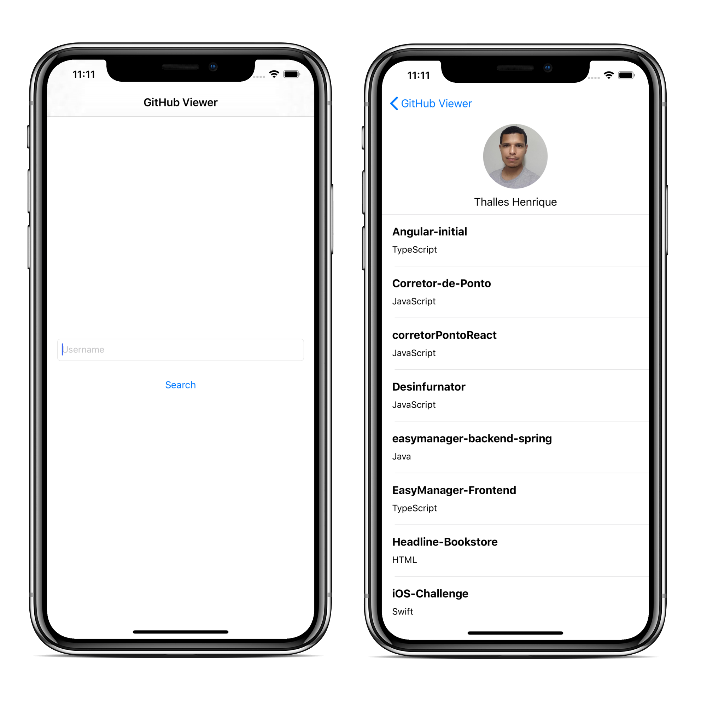

# GitHub Viewer (RepoSearch)

Aplicação para visualização de perfis do GitHub (via Username)

## Implementação

- Swift 5/XCode 11
- CocoaPods para gerenciamento de dependências
- Alamofire (requisições REST)
- Kingfisher (Download de imagens)
- ObjectMapper (mapeamento de JSON para objetos Swift)

## Design Patterns
- Coordinator